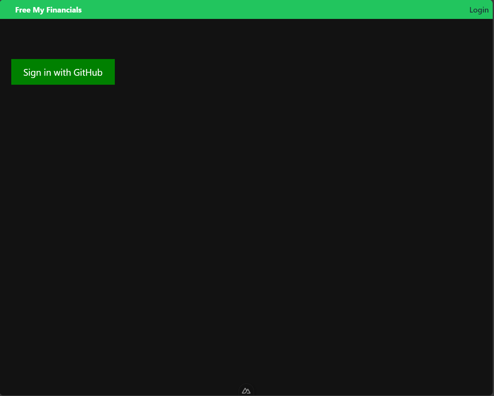
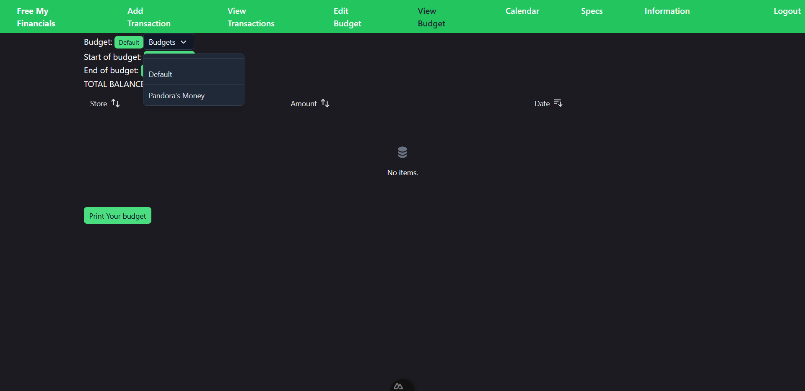
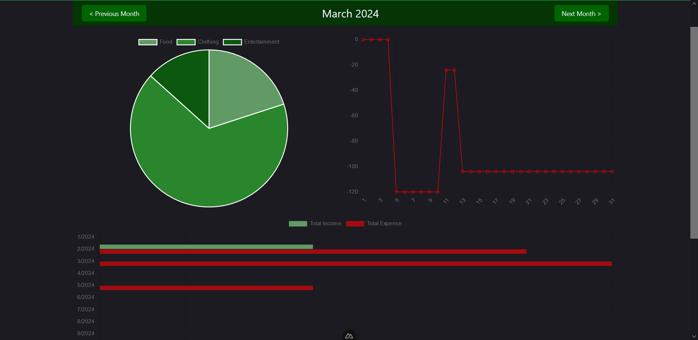

# User Guide

- Click on the link the the webpage. You will be welcomed to this page:

- From here you can read about the various features, and click on the get started button to be sent to a login page, with a button to allow you to login with a github account, please do this in order to be able to access any of the other resources.

- To navigate to pages, click on any of the messages on the top green bar. Free My Financials takes you to the home page. Add Transaction takes you to the add page. View Transactions takes you to the budgeting page. Edit budget takes you to a page to edit budget amount and dates. View budget lets you view that budget. Calender places transactions on various dates. Information takes you to useful links. Specs will show you graphs related to your budget

- To use Free My Financials, you need to add transactions, including paychecks, to record your budget! A budget is simply the amount of money you have. The Add Page allows you to select from a drop down if the transaction is a expense or an income. You can then type out all the other requested information and hit submit to record the transaction. Here is an example paycheck

- And here is an example expense. For expenses, you have you select a category with the drop down menu or add a custom category. The following uses the default food category.

- Once you have added your transactions, you can then click the view page. At the top of the page will be your total balance. If you find that a transaction was misentered, you can click the transaction to remove it. In this example, Boger Kong was a incorrect transaction. Once deleted, it will no longer affect your budget.

- With all that info, you can now track your finances in Free My Financials! Good luck and happy budgeting.

- Whats a budgeting app without a traditional budget. This page works very similar to the add transaction page, but you have two dates, one for when the budget ends and one for when it starts. You can also check the Create A New Budget Box to add a new budget. If not creating a new budget. Fill the name as the budget you want to edit. 

- In the view budget panel, you have a view similar to history, but the total is based on how much was put into the specific budget. Press the print budget to get this page as a PDF for physical document for your records.

- To change the budget you are viewing, click the Budgets button to open the drop down, then click the budget you want to view. The budget you select here is where transactions will be added and where the specs page displays info. The page will refresh when you select a new budget, do not be alarmed.
- To create multiple budgets, create a new budget and check the, "Click to create a new budget", checkbox. To view the new budget, go to the View Budget page and click on the new budget in the dropdown.

- The calendar view places transactions on the date they occured in a traditional calander view.

- Here is the specs page! Mouse over various graphs to learn specific data about your spending. You can also change the month using the buttons at the top of the page. At the buttom of this page it will inform you if you are below or above your current budget.