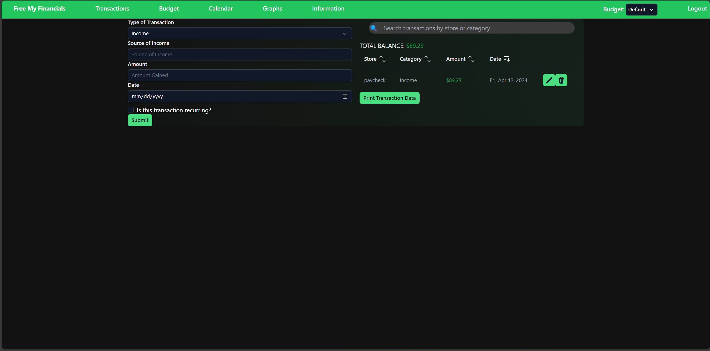
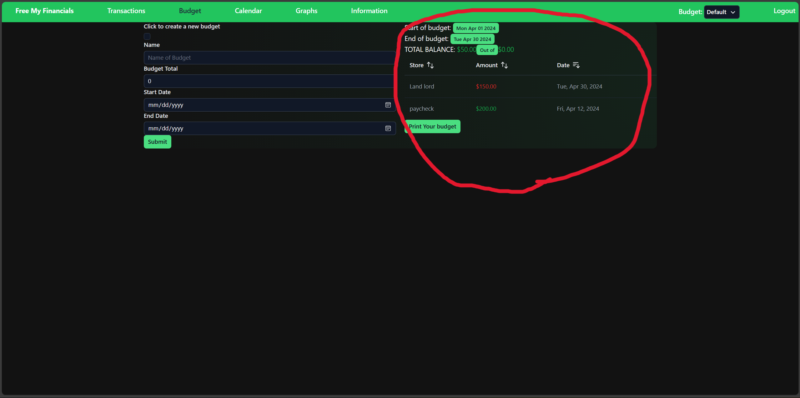

# User Guide

- Click on the link the the webpage. You will be welcomed to this page:

- From here you can read about the various features, and click on the links in the description to go to that page. The get started button takes you to the edit budget page.
- To navigate to pages, click on any of the messages on the top green bar. Free My Financials takes you to the home page. Add Transaction takes you to the add page. View Transactions takes you to the budgeting page. Edit budget takes you to a page to edit budget amount and dates. View budget lets you view that budget. Calender places transactions on various dates.

- To use Free My Financials, you need to add transactions, including paychecks, to record your budget! A budget is simply the amount of money you have. The Add Page allows you to select from a drop down if the transaction is a expense or an income. You can then type out all the other requested information and hit submit to record the transaction. Here is an example paycheck

- Once you have added your transactions, you can then click the view page. At the top of the page will be your total balance. If you find that a transaction was misentered, you can click the transaction to remove it. In this example, Boger Kong was a incorrect transaction. Once deleted, it will no longer affect your budget.

- With all that info, you can now track your finances in Free My Financials! Good luck and happy budgeting.

- Whats a budgeting app without a traditional budget. This page works very similar to the add transaction page, but you have two dates, one for when the budget ends and one for when it starts.

- In the view budget panel, you have a view similar to history, but the total is based on how much was put into the specific budget

- The calendar view places transactions on the date they occured in a traditional calander view.

