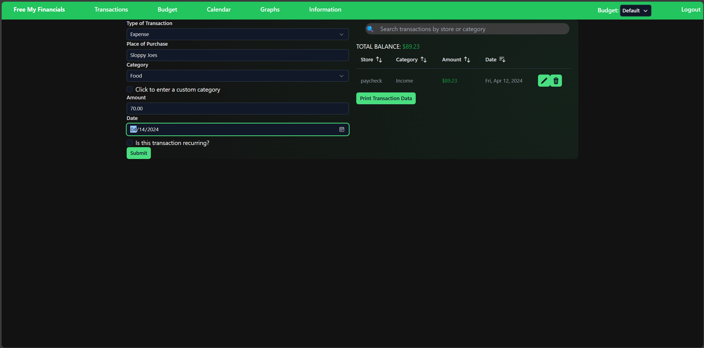

# User Guide

- Click on the link to the webpage. You will be welcomed to this page:

- From here you can read about the various features, and click on the "Login with Google" button to be sent to Google's account selector asking you to chose and account to login with (login might happen automatically depending on your browser settings), please do this in order to be able to access any of the other resources.
- Once logged in, the page should look mostly similar, but now with more buttons on the green header bar

- To navigate to pages, click on any of the messages on the top green bar. Free My Financials takes you to the home page. Transaction takes you to the transaction management page. Budget takes you to a page to see tranactions in a specific budget, edit a budget, or create a new one. Calender places transactions on various dates. Graphs will take you to some graphs displaying your transaction information for the currently seelcted budget. Information takes you to useful links to articles on financial advice.

- To use Free My Financials, you need to add transactions, including paychecks, to record your budget! A budget is simply the amount of money you have. The Transaction Page allows you to select from a drop down if the transaction is a expense or an income. You can then type out all the other requested information and hit submit to record the transaction. Here is an example paycheck

- While you have atleast one transaction submitted, you will see a searchable list displaying all transactions entered for your account

- And here is an example expense. For expenses, you have you select a category with the drop down menu or add a custom category. The following uses the default food category.

- If you want to label a transaction as reoccuring, you can check the small box at the bottom of the into page, and choose to have it be a monthly, weekly, or biweekly transaction. upon entering the end of its reoccurance and clicking submit, the program will automaticaly fill out each instance the transaction would happen.

- Once you have added your transactions, you can then edit or delete them from the menu on the right. At the top of the menu will be your total balance. If you find that a transaction was misentered, you can click the pencil icon, which will prompt a confirmation that of which transaction you wish to edit.
 
- you can then change the information in the left menu before clicking submit to edit the transaction
 
 

- If you want to delete a transaction, you can click on the trash icon to the right of a transaction, which will prompt a confirmation box to ensure you really want to delete it. In this example, Sloppy Joes was a incorrect transaction. Once deleted, it will no longer affect your budget.
 
 

- Whats a budgeting app without a traditional budget? This page works very similar to the transaction page, but you have two dates, one for when the budget ends and one for when it starts. You can also check the Create A New Budget Box to add a new budget. If not creating a new budget, the information you enter will be appiled to the budget you currently have selected(currently selected budget is shown in the header bar). 

- In the view budget panel, you have a view similar to transactions, but the total is based on how much was put into the specific budget. Press the print budget to get this page as a PDF for physical document for your records.

- To change the budget you are viewing, click the \/ to the right of "Budget:" on the header bar to open the drop down, then click the budget you want to view. The budget you select here is where transactions will be added and where the specs page displays info. The page will refresh when you select a new budget, do not be alarmed. The selected budget can be changed from the header bar on any page at any time
 
- To create aditional budgets,check the "Click to create a new budget" checkbox and fill out the information before clicking submit. The selected budget will automatically change to the new budget when it is created.

- The calendar view places transactions on the date they occured in a traditional calander view.

- Here is the graph page! Mouse over various graphs to learn specific data about your spending. You can also change the month using the buttons at the top of the page. At the buttom of this page it will inform you if you are below or above your current budget.

- Finally, we have the information page. Which just has some links to articles with financial advice that you might find helpful.

- With all that info, you can now track your finances in Free My Financials! Good luck and happy budgeting.