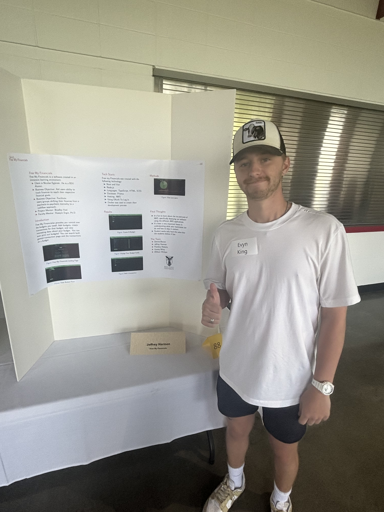
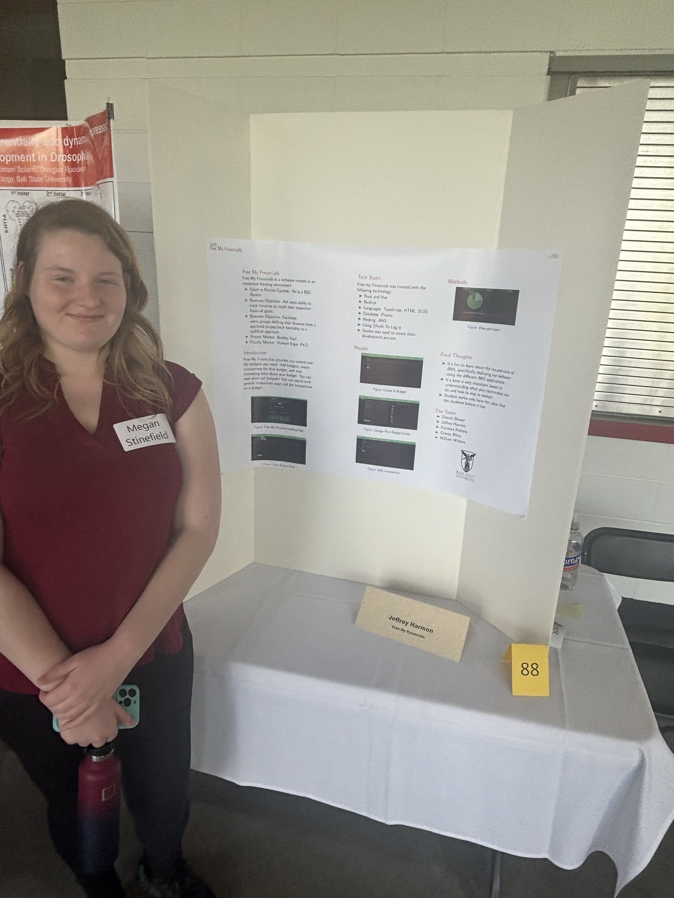

# Student Symposium

## Visitors
- Evyn king

- Megan Stinefield

- Conner Um

- Logan Parker
 
- Sara Vasquez

## Our Experiences

- William
  - It was a very different expereince then other software project presentations I have attended before. I was not at all thinking about the symposium having judges inspecting the presentations, and it made me feel a little more tense then I would have been otherwise. Though I will say it was a little dissapointing that we didn't get more people approaching our team's poster to ask questions, I was somewhat hoping to see more reactions to it.

- Grant
  - I was not able to attend the symposium but it sounds similar to what we did at the banquet. Networking is important to establish a proffessional career and judging allows programs to critically assess their work for improvement. Had I not taken an extra shift to pay for this month's rent I would have attended.

- Dennis
  - I was also unable to attend the symposium, but upon talking to friends and peers from our course, it seemed like our group's experiences pretty much matched theirs. I think the symposium, and other presentation events like it, are important to help our group network. Networking is something that we've heard from our mentor time and time again during our meetings, and being able to show off the software that we've worked so hard on and here the feedback of people unattached from our work helps to give us some unbiased notes.
